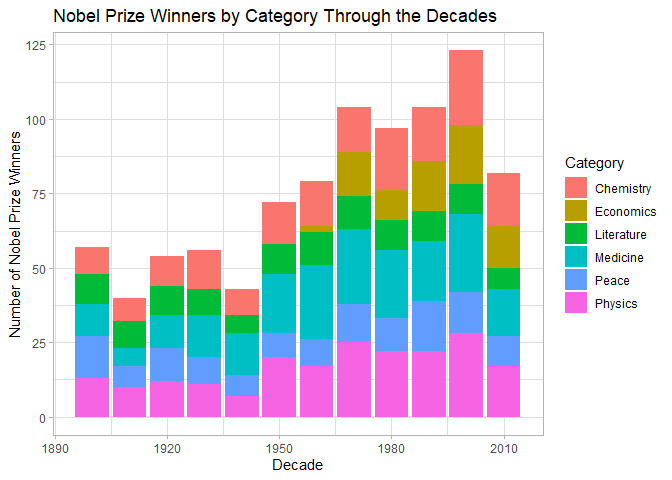
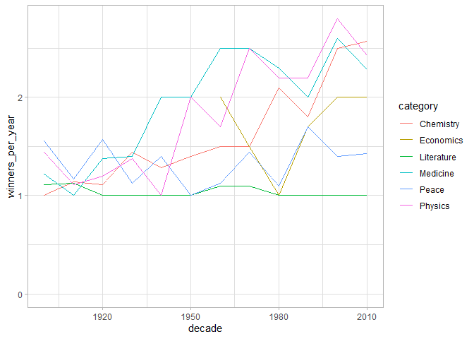
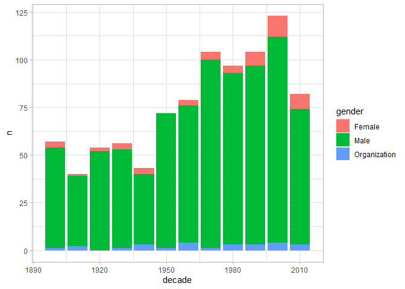
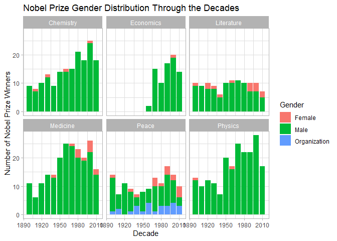
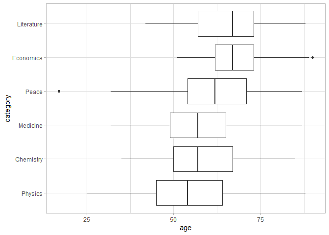
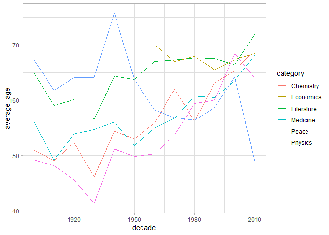
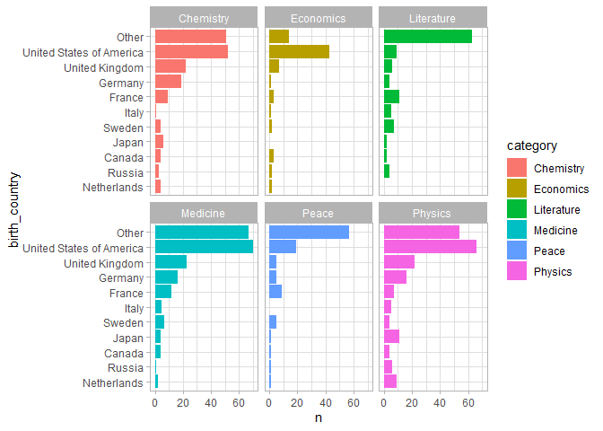

Data Analysis and Visualizations on Nobel Prize Winners Dataset
================

This project is one of my R projects series. In this project, we have a
Nobel Prize winners dataset from the weekly Tidy Tuesday event. The
dataset contains 969 observations and covers metadata for all of the
Nobel prize winners in physics, chemistry, and physiology or medicine
from 1900 to 2016. A more detailed description of the dataset can be
found
[here](https://github.com/rfordatascience/tidytuesday/tree/master/data/2019/2019-05-14)

The goal of this project is to perform data anaylsis and visualizations
on the Nobel Prize winners dataset to draw insights from the data.

``` r
# Import the library
library(tidyverse)
```

    ## -- Attaching packages ------------------------------------ tidyverse 1.3.0 --

    ## v ggplot2 3.3.1     v purrr   0.3.4
    ## v tibble  3.0.1     v dplyr   0.8.5
    ## v tidyr   1.1.0     v stringr 1.4.0
    ## v readr   1.3.1     v forcats 0.5.0

    ## -- Conflicts --------------------------------------- tidyverse_conflicts() --
    ## x dplyr::filter() masks stats::filter()
    ## x dplyr::lag()    masks stats::lag()

``` r
library(lubridate)
```

    ## 
    ## Attaching package: 'lubridate'

    ## The following objects are masked from 'package:dplyr':
    ## 
    ##     intersect, setdiff, union

    ## The following objects are masked from 'package:base':
    ## 
    ##     date, intersect, setdiff, union

``` r
theme_set(theme_light())
```

``` r
# Import the data
nobel_winners <- readr::read_csv("https://raw.githubusercontent.com/rfordatascience/tidytuesday/master/data/2019/2019-05-14/nobel_winners.csv") %>%
  distinct(full_name, prize_year, category, .keep_all = TRUE) %>%
  mutate(decade = 10 * (prize_year %/% 10),
         age = prize_year - year(birth_date))
```

    ## Parsed with column specification:
    ## cols(
    ##   prize_year = col_double(),
    ##   category = col_character(),
    ##   prize = col_character(),
    ##   motivation = col_character(),
    ##   prize_share = col_character(),
    ##   laureate_id = col_double(),
    ##   laureate_type = col_character(),
    ##   full_name = col_character(),
    ##   birth_date = col_date(format = ""),
    ##   birth_city = col_character(),
    ##   birth_country = col_character(),
    ##   gender = col_character(),
    ##   organization_name = col_character(),
    ##   organization_city = col_character(),
    ##   organization_country = col_character(),
    ##   death_date = col_date(format = ""),
    ##   death_city = col_character(),
    ##   death_country = col_character()
    ## )

``` r
# Create a count table for the category
nobel_winners %>%
  count(category, sort = TRUE)
```

    ## # A tibble: 6 x 2
    ##   category       n
    ##   <chr>      <int>
    ## 1 Medicine     211
    ## 2 Physics      204
    ## 3 Chemistry    175
    ## 4 Peace        130
    ## 5 Literature   113
    ## 6 Economics     78

As we can see from 6 Nobel Prize categories above, the ‘Medicine’
category has the highest number of winners. On the other hand, the
‘Economy’ category seems to has the least number of winners.

``` r
# Create a plot for the number of winners by decade
nobel_winners %>%
  count(category, decade) %>%
  ggplot(aes(decade, n, fill =  category)) +
  geom_col() +
  labs(x = "Decade",
       y = "Number of Nobel Prize Winners",
       fill = "Category",
       title  = "Nobel Prize Winners by Category Through the Decades")
```

<!-- --> 

A quick look at the plot above, we can see that The ‘Economics’ category was not
introduced until the 1960s, this is why the ‘Economics’ category has the
least number of winners.

``` r
# Create a plot for winners per year and group them by category 
nobel_winners %>%
  group_by(category, decade) %>%
  summarize(winners = n(),
            winners_per_year = winners / n_distinct(prize_year)) %>%
  ggplot(aes(decade, winners_per_year, color = category)) +
  geom_line() +
  expand_limits(y = 0)
```

<!-- --> 

From the plot above, we can observe that: 
- The ‘Literature’ category almost only has 1 winner per year. 
- The number of winners per year in ‘Medicine’, ‘Physics’, and ‘Chemistry’ tend to increase. - The ‘Economics’ category seems to be introduced in the late 1960s.

``` r
# Create a plot of winners by gender
nobel_winners %>%
  count(decade, 
        gender = coalesce(gender, laureate_type)) %>%
  ggplot(aes(decade, n, fill = gender)) +
  geom_col()
```

<!-- --> 

From the plot, it is clear that men have been dominating the Nobel Prize
throughout the decades. It is also interesting to see that the number of
women winners are increasing.

``` r
# Create a plot of winners by gender through the decades
nobel_winners %>%
  count(decade,
        category,
        gender = coalesce(gender, laureate_type)) %>%
  group_by(decade, category) %>%
  ggplot(aes(decade, n, fill = gender)) +
  geom_col() +
  facet_wrap(~ category) +
  labs(x = "Decade",
       y = "Number of Nobel Prize Winners",
       fill = "Gender",
       title = "Nobel Prize Gender Distribution Through the Decades")
```

<!-- --> 

When we group our previous plot by category, we can clearly see that men are
dominating the ‘Economics’ and ‘Physics’ categories. However, the
proportion between men and women are more even in the ‘Literature’
category. Also, the ‘Peace’ category is the only prize that has been
awarded to organizations instead of individuals.

``` r
# Filter for women laureates in Economics and Physics
nobel_winners %>%
  filter(category %in% c("Economics", "Physics"), gender == "Female")
```

    ## # A tibble: 3 x 20
    ##   prize_year category prize motivation prize_share laureate_id laureate_type
    ##        <dbl> <chr>    <chr> <chr>      <chr>             <dbl> <chr>        
    ## 1       1903 Physics  The ~ "\"in rec~ 1/4                   6 Individual   
    ## 2       1963 Physics  The ~ "\"for th~ 1/4                  79 Individual   
    ## 3       2009 Economi~ The ~ "\"for he~ 1/2                 846 Individual   
    ## # ... with 13 more variables: full_name <chr>, birth_date <date>,
    ## #   birth_city <chr>, birth_country <chr>, gender <chr>,
    ## #   organization_name <chr>, organization_city <chr>,
    ## #   organization_country <chr>, death_date <date>, death_city <chr>,
    ## #   death_country <chr>, decade <dbl>, age <dbl>

Surprisingly, there were only 1 woman Nobel laureate in ‘Economics’ and
2 women Nobel laureates in Physics.

``` r
# Create a box plot for winners in category by age
nobel_winners %>%
  mutate(category = fct_reorder(category, age, median, na.rm = TRUE)) %>%
  ggplot(aes(category, age)) +
  geom_boxplot() +
  coord_flip()
```

    ## Warning: Removed 30 rows containing non-finite values (stat_boxplot).

<!-- --> 

From the box plot above, we can observe that the ‘Physics’ category has the
youngest Nobel laureates while ‘Literature’ and ‘Economics’ have the
oldest.

``` r
# Create a line plot for winners in by age through the decades
nobel_winners %>%
  filter(!is.na(age)) %>%
  group_by(decade, category) %>%
  summarize(average_age = mean(age),
            median_age = median(age)) %>%
  ggplot(aes(decade, average_age, color = category)) +
  geom_line()
```

<!-- -->

Interestingly, there seems to be a trend in the ‘Physics’ category where
the Nobel laureates are getting older. Also, on average, the Nobel Prize
in ‘Economics’ has been consistently given to people in their late 60s.

``` r
# Create a plot for winners by birth country
nobel_winners %>%
  filter(!is.na(birth_country)) %>%
  count(birth_country = fct_lump(birth_country, 9),
        category,
        sort = TRUE) %>%
  mutate(birth_country = fct_reorder(birth_country, n)) %>%
  ggplot(aes(birth_country, n, fill = category)) +
  geom_col() +
  facet_wrap(~ category) +
  coord_flip()
```

<!-- --> 

From the plots above, we can see that the Nobel Prize winners in ‘Literature’
and ‘Peace’ are more likely to be spread across the world than the other
categories. In contrast, the ‘Economics’ category seems to be highly
dominated by people from the USA.
