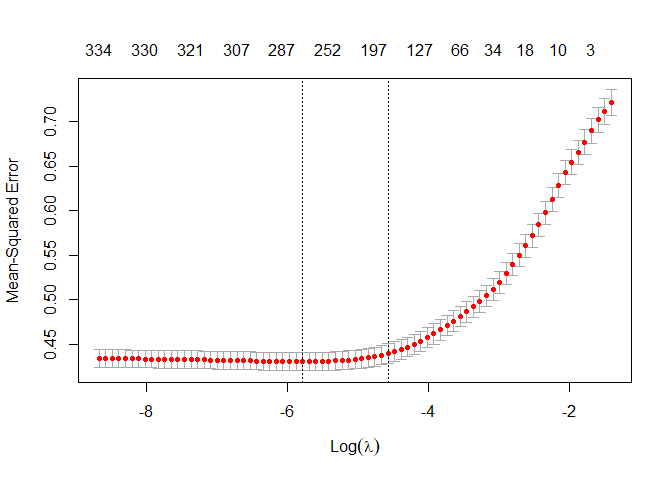

Regression Analysis on Board Games Dataset
================

This project is one of my R projects series. In this project, we have a
board games dataset from the weekly Tidy Tuesday event. The dataset
contains 10,532 board games with at least 50 ratings between 1950 and
2016. A more detailed description of the dataset can be found
[here](https://github.com/rfordatascience/tidytuesday/tree/master/data/2019/2019-03-12)

The goal of this project is to perform a regression analysis on the
board games dataset and build a model to predict the average ratings of
the games.

``` r
# Import the libraries
library(tidyverse)
```

    ## -- Attaching packages ------------------------------------------ tidyverse 1.3.0 --

    ## v ggplot2 3.3.1     v purrr   0.3.4
    ## v tibble  3.0.1     v dplyr   0.8.5
    ## v tidyr   1.1.0     v stringr 1.4.0
    ## v readr   1.3.1     v forcats 0.5.0

    ## -- Conflicts --------------------------------------------- tidyverse_conflicts() --
    ## x dplyr::filter() masks stats::filter()
    ## x dplyr::lag()    masks stats::lag()

``` r
library(broom)
theme_set(theme_light())
```

``` r
# Import the data
board_games_raw <- readr::read_csv("https://raw.githubusercontent.com/rfordatascience/tidytuesday/master/data/2019/2019-03-12/board_games.csv")
```

    ## Parsed with column specification:
    ## cols(
    ##   .default = col_character(),
    ##   game_id = col_double(),
    ##   max_players = col_double(),
    ##   max_playtime = col_double(),
    ##   min_age = col_double(),
    ##   min_players = col_double(),
    ##   min_playtime = col_double(),
    ##   playing_time = col_double(),
    ##   year_published = col_double(),
    ##   average_rating = col_double(),
    ##   users_rated = col_double()
    ## )

    ## See spec(...) for full column specifications.

``` r
# The holdout set will be 20% of our raw data
holdout_set <- board_games_raw %>%
  filter(game_id %% 5 == 0)

# The training set will be 80% of our data
board_games <- board_games_raw %>%
  filter(game_id %% 5 != 0)
```

## Exploratory Data Analysis (EDA)

Let’s first do some EDA on our data.

``` r
# View the number of board game publishers
board_games_raw %>%
  count(publisher, sort = TRUE)
```

    ## # A tibble: 5,513 x 2
    ##    publisher                                n
    ##    <chr>                                <int>
    ##  1 GMT Games                              180
    ##  2 SPI (Simulations Publications, Inc.)   128
    ##  3 Ravensburger Spieleverlag GmbH         103
    ##  4 Avalon Hill                            102
    ##  5 KOSMOS                                  74
    ##  6 Decision Games (I)                      71
    ##  7 Queen Games                             70
    ##  8 Games Workshop Ltd.                     62
    ##  9 Hasbro                                  62
    ## 10 Avalanche Press Ltd.                    60
    ## # ... with 5,503 more rows

Looks like we have roughly 5500 distinct board game publishers. Also,
some of them have more than 100 types of board games. Interesting\!

``` r
# Create a line plot for the number of board games by year published
board_games_raw %>%
  count(year_published) %>%
  ggplot(aes(year_published, n)) +
  geom_line()
```

<!-- -->

We can see from the plot that our data seems to contain more recent data
than the older ones. This might also indicate that there are way more
board games recently than those of in the past.

``` r
# Create a histogram for the average rating
board_games_raw %>%
  ggplot(aes(average_rating)) +
  geom_histogram()
```

    ## `stat_bin()` using `bins = 30`. Pick better value with `binwidth`.

<!-- -->

From the histogram above, the average rating of the board games seems to
be quite normally distributed around the 6.25 value. This is a good news
if we might want to fit a model to predict these ratings.

``` r
# View the number of board games by maximum playtime
board_games_raw %>%
  count(max_playtime, sort = TRUE)
```

    ## # A tibble: 83 x 2
    ##    max_playtime     n
    ##           <dbl> <int>
    ##  1           30  1898
    ##  2           60  1608
    ##  3           45  1164
    ##  4           20   972
    ##  5          120   879
    ##  6           90   864
    ##  7           15   540
    ##  8          180   443
    ##  9           10   373
    ## 10            0   350
    ## # ... with 73 more rows

From the table above, we can observe that most board games in our data
have the maximum playtime of 30 minutes, followed by 60 minutes and 45
minutes respectively.

``` r
# Create a tibble for the categorical variables
categorical_variables <- board_games %>%
  select(game_id, name, family, category, artist, designer, mechanic) %>%
  gather(type, value, -game_id, -name) %>%
  filter(!is.na(value)) %>%
  separate_rows(value, sep = ",") %>%
  arrange(game_id)
```

After making a tibble for the categorical variables, we can explore more
about these variables.

``` r
# Create a variable for the counts
categorical_counts <- categorical_variables %>%
  count(type, value, sort = TRUE)
categorical_counts
```

    ## # A tibble: 11,464 x 3
    ##    type     value                         n
    ##    <chr>    <chr>                     <int>
    ##  1 category Card Game                  2359
    ##  2 mechanic Dice Rolling               1968
    ##  3 mechanic Hand Management            1748
    ##  4 category Wargame                    1621
    ##  5 mechanic Set Collection             1060
    ##  6 mechanic Hex-and-Counter             996
    ##  7 mechanic Variable Player Powers      974
    ##  8 category Fantasy                     966
    ##  9 family   Crowdfunding: Kickstarter   802
    ## 10 mechanic Tile Placement              722
    ## # ... with 11,454 more rows

We can see that the most popular board game category is ‘Card Game’ with
almost 2400 games while the most popular game mechanic being ‘Dice
Rolling’ games. We can make a bar plot to visualize these findings
better.

``` r
# Create a bar plot for the top 10 board games categories
categorical_counts %>%
  filter(type == "category") %>%
  head(10) %>%
  mutate(category = fct_reorder(value, n)) %>%
  ggplot(aes(category, n)) +
  geom_col() +
  coord_flip() +
  labs(x = "Game Category",
       y = "Number of Board Games",
       title = "The Most Popular Board Games Category")
```

<!-- -->

The bar plot above clearly shows that ‘Card Game’ based board games are
way more popular and common than the other categories, followed by
‘Wargame’ and ‘Fantasy’ respectively.

``` r
library(drlib)
```

    ## 
    ## Attaching package: 'drlib'

    ## The following object is masked from 'package:tidyr':
    ## 
    ##     expand_grid

``` r
# Create a plot for the categorical variables
categorical_counts %>%
  group_by(type) %>%
  top_n(10, n) %>%
  ungroup() %>%
  mutate(value = reorder_within(value, n, type),
         type = fct_reorder(type, n, .desc = TRUE)) %>%
  ggplot(aes(value, n, fill = type)) +
  geom_col(show.legend = FALSE) +
  facet_wrap(~ type, scales = "free_y") +
  coord_flip() +
  scale_x_reordered() +
  labs(title = "Most Common Categorical Variables")
```

<!-- -->

We can observe that the game mechanic and category are two of the most
common categorical variables in our data. This could be useful as they
might be our determining predictors for our model.

## Predicting the Average Ratings

Now, let’s build a model to predict the average ratings.

``` r
# Use the maximum players as the predictor
lm(average_rating ~ max_players, board_games) %>%
  summary()
```

    ## 
    ## Call:
    ## lm(formula = average_rating ~ max_players, data = board_games)
    ## 
    ## Residuals:
    ##     Min      1Q  Median      3Q     Max 
    ## -4.9843 -0.5459  0.0222  0.5727  2.4769 
    ## 
    ## Coefficients:
    ##               Estimate Std. Error t value Pr(>|t|)    
    ## (Intercept)  6.3771057  0.0097440 654.468   <2e-16 ***
    ## max_players -0.0010739  0.0005243  -2.048   0.0406 *  
    ## ---
    ## Signif. codes:  0 '***' 0.001 '**' 0.01 '*' 0.05 '.' 0.1 ' ' 1
    ## 
    ## Residual standard error: 0.8496 on 8364 degrees of freedom
    ## Multiple R-squared:  0.0005014,  Adjusted R-squared:  0.0003819 
    ## F-statistic: 4.196 on 1 and 8364 DF,  p-value: 0.04056

From the summary above, it seems that the maximum barely has an effect
on the average rating. However, let’s try a log transformation.

``` r
lm(average_rating ~ 
     log2(max_players + 1), board_games) %>%
  summary()
```

    ## 
    ## Call:
    ## lm(formula = average_rating ~ log2(max_players + 1), data = board_games)
    ## 
    ## Residuals:
    ##     Min      1Q  Median      3Q     Max 
    ## -4.8541 -0.5335  0.0187  0.5682  2.5925 
    ## 
    ## Coefficients:
    ##                       Estimate Std. Error t value Pr(>|t|)    
    ## (Intercept)            6.80203    0.03276   207.6   <2e-16 ***
    ## log2(max_players + 1) -0.17785    0.01298   -13.7   <2e-16 ***
    ## ---
    ## Signif. codes:  0 '***' 0.001 '**' 0.01 '*' 0.05 '.' 0.1 ' ' 1
    ## 
    ## Residual standard error: 0.8404 on 8364 degrees of freedom
    ## Multiple R-squared:  0.02196,    Adjusted R-squared:  0.02184 
    ## F-statistic: 187.8 on 1 and 8364 DF,  p-value: < 2.2e-16

Now it’s better\! It seems that games with more players tend to get
lower average ratings. Next, let’s add maximum playtime to our
predictors.

``` r
lm(average_rating ~ 
     log2(max_players + 1) +
     log2(max_playtime +1), board_games) %>%
  summary()
```

    ## 
    ## Call:
    ## lm(formula = average_rating ~ log2(max_players + 1) + log2(max_playtime + 
    ##     1), data = board_games)
    ## 
    ## Residuals:
    ##     Min      1Q  Median      3Q     Max 
    ## -4.9253 -0.5081  0.0280  0.5371  2.8516 
    ## 
    ## Coefficients:
    ##                         Estimate Std. Error t value Pr(>|t|)    
    ## (Intercept)             6.017356   0.045383  132.59   <2e-16 ***
    ## log2(max_players + 1)  -0.153459   0.012589  -12.19   <2e-16 ***
    ## log2(max_playtime + 1)  0.131275   0.005437   24.14   <2e-16 ***
    ## ---
    ## Signif. codes:  0 '***' 0.001 '**' 0.01 '*' 0.05 '.' 0.1 ' ' 1
    ## 
    ## Residual standard error: 0.8126 on 8363 degrees of freedom
    ## Multiple R-squared:  0.0857, Adjusted R-squared:  0.08548 
    ## F-statistic: 391.9 on 2 and 8363 DF,  p-value: < 2.2e-16

The summary tells us that every time we double the number of maximum
players, the average rating will decrease by approximately 0.15. On the
other hand, if we double the amount of maximum playtime, the average
rating will increase by roughly 0.13.

``` r
# Create a plot for the average rating by decade
board_games %>%
  group_by(decade = 10 * (year_published %/% 10)) %>%
  summarize(average_rating = mean(average_rating)) %>%
  ggplot(aes(decade, average_rating)) +
  geom_line()
```

<!-- -->

As we can see from the plot, there seems to be a general increasing
trend here. This is to say that, newer games tend to get higher average
ratings.

``` r
# Add the year published to our predictors
lm(average_rating ~ 
     log2(max_players + 1) +
     log2(max_playtime +1) +
     year_published, board_games) %>%
  summary()
```

    ## 
    ## Call:
    ## lm(formula = average_rating ~ log2(max_players + 1) + log2(max_playtime + 
    ##     1) + year_published, data = board_games)
    ## 
    ## Residuals:
    ##     Min      1Q  Median      3Q     Max 
    ## -4.9908 -0.4450  0.0204  0.4810  2.8942 
    ## 
    ## Coefficients:
    ##                          Estimate Std. Error t value Pr(>|t|)    
    ## (Intercept)            -4.729e+01  1.355e+00  -34.91   <2e-16 ***
    ## log2(max_players + 1)  -1.905e-01  1.160e-02  -16.42   <2e-16 ***
    ## log2(max_playtime + 1)  1.646e-01  5.065e-03   32.49   <2e-16 ***
    ## year_published          2.657e-02  6.748e-04   39.37   <2e-16 ***
    ## ---
    ## Signif. codes:  0 '***' 0.001 '**' 0.01 '*' 0.05 '.' 0.1 ' ' 1
    ## 
    ## Residual standard error: 0.7464 on 8362 degrees of freedom
    ## Multiple R-squared:  0.2287, Adjusted R-squared:  0.2284 
    ## F-statistic: 826.4 on 3 and 8362 DF,  p-value: < 2.2e-16

As we can see here, adding the year published to our predictors
significantly reduce our residual standard error to 0.7464.

``` r
# Create a tibble for the average rating based on categorical variables
board_games %>%
  inner_join(categorical_variables, by = c("game_id", "name")) %>%
  select(type, value, average_rating) %>%
  group_by(type, value) %>%
  summarize(games = n(),
            average_rating = mean(average_rating)) %>%
  arrange(desc(games))
```

    ## # A tibble: 11,464 x 4
    ## # Groups:   type [5]
    ##    type     value                     games average_rating
    ##    <chr>    <chr>                     <int>          <dbl>
    ##  1 category Card Game                  2359           6.25
    ##  2 mechanic Dice Rolling               1968           6.58
    ##  3 mechanic Hand Management            1748           6.53
    ##  4 category Wargame                    1621           6.77
    ##  5 mechanic Set Collection             1060           6.29
    ##  6 mechanic Hex-and-Counter             996           6.75
    ##  7 mechanic Variable Player Powers      974           6.78
    ##  8 category Fantasy                     966           6.52
    ##  9 family   Crowdfunding: Kickstarter   802           6.78
    ## 10 mechanic Tile Placement              722           6.49
    ## # ... with 11,454 more rows

Now, let’s visualize it with a box plot to better understand it.

``` r
# Create a box plot for the average rating by category
board_games %>%
  inner_join(categorical_variables, by = c("game_id", "name")) %>%
  filter(type == "category") %>%
  mutate(value = fct_lump(value, 15),
         value = fct_reorder(value, average_rating)) %>%
  ggplot(aes(value, average_rating)) +
  geom_boxplot() +
  coord_flip()
```

<!-- -->

From the box plot above, we can see that World War II games get the
highest average rating while children’s games get the lowest.

``` r
# Create a box plot for the average rating by mechanic
board_games %>%
  inner_join(categorical_variables, by = c("game_id", "name")) %>%
  filter(type == "mechanic") %>%
  mutate(value = fct_lump(value, 15),
         value = fct_reorder(value, average_rating)) %>%
  ggplot(aes(value, average_rating)) +
  geom_boxplot() +
  coord_flip()
```

<!-- -->

The box plot above shows that simulation-based games get the highest
rating. In contrast, the ‘Roll / Spin and Move’ games get a
significantly lower average ratings than the others. Hence, we can
conclude that categorical variables can be correlated with higher or
lower rated games.

``` r
# Create a tibble for the features
features <- categorical_variables %>%
  unite(feature, type, value) %>%
  add_count(feature) %>%
  filter(n >= 20)

# Import additional libraries
library(glmnet)
```

    ## Loading required package: Matrix

    ## 
    ## Attaching package: 'Matrix'

    ## The following objects are masked from 'package:tidyr':
    ## 
    ##     expand, pack, unpack

    ## Loaded glmnet 4.0

``` r
library(tidytext)
```

    ## 
    ## Attaching package: 'tidytext'

    ## The following objects are masked from 'package:drlib':
    ## 
    ##     reorder_within, scale_x_reordered, scale_y_reordered

``` r
library(Matrix)
```

First, let’s declare the predictors and the target for our regression
model

``` r
# Predictor
feature_matrix <- features %>%
  cast_sparse(game_id, feature)

# Target
ratings <- board_games$average_rating[match(rownames(feature_matrix), board_games$game_id)]
```

Now, let’s fit our data to a Lasso Regression model using the glmnet
library. Here, we will also be using the Cross-Validation (CV) method.

``` r
# Fit the model and use the CV method
cv_lasso <- cv.glmnet(feature_matrix, ratings)
cv_lasso$glmnet.fit %>%
  tidy()
```

    ## # A tibble: 14,826 x 5
    ##    term                           step estimate lambda dev.ratio
    ##    <chr>                         <dbl>    <dbl>  <dbl>     <dbl>
    ##  1 (Intercept)                       1   6.37    0.245    0     
    ##  2 (Intercept)                       2   6.38    0.223    0.0141
    ##  3 designer_(Uncredited)             2  -0.0942  0.223    0.0141
    ##  4 (Intercept)                       3   6.38    0.203    0.0269
    ##  5 mechanic_Roll / Spin and Move     3  -0.0105  0.203    0.0269
    ##  6 designer_(Uncredited)             3  -0.177   0.203    0.0269
    ##  7 (Intercept)                       4   6.39    0.185    0.0441
    ##  8 mechanic_Roll / Spin and Move     4  -0.0661  0.185    0.0441
    ##  9 category_Wargame                  4   0.0110  0.185    0.0441
    ## 10 designer_(Uncredited)             4  -0.237   0.185    0.0441
    ## # ... with 14,816 more rows

We can see how, in each step, different features are affecting our
target with different coefficients. Also, notice that we have a
parameter lambda to avoid overfitting the data.

``` r
# View the summary of our model
cv_lasso
```

    ## 
    ## Call:  cv.glmnet(x = feature_matrix, y = ratings) 
    ## 
    ## Measure: Mean-Squared Error 
    ## 
    ##      Lambda Measure      SE Nonzero
    ## min 0.00309  0.4304 0.01015     274
    ## 1se 0.01036  0.4396 0.01085     179

Let’s visualize this to see how the MSE changes when the lambda values
are changing.

``` r
# Create a plot for the MSE and lambda
plot(cv_lasso)
```

<!-- -->

From the plot above we can see that as the lambda value decreases, the
MSE also tend to decrease. However, it seems that until it reaches a
certain lambda value, the MSE will start to increase again. Let’s use
the “one-standard-error” rule to select the best model.

``` r
# View the "one-standard-error" lambda value
cv_lasso$lambda.1se
```

    ## [1] 0.01035688

Now, let’s fit that lambda value to our model.

``` r
cv_lasso$glmnet.fit %>%
  tidy() %>%
  filter(lambda == cv_lasso$lambda.1se) %>%
  arrange(desc(estimate))
```

    ## # A tibble: 180 x 5
    ##    term                           step estimate lambda dev.ratio
    ##    <chr>                         <dbl>    <dbl>  <dbl>     <dbl>
    ##  1 (Intercept)                      35    6.11  0.0104     0.415
    ##  2 designer_Urs Hostettler          35    0.519 0.0104     0.415
    ##  3 family_Tableau Building          35    0.513 0.0104     0.415
    ##  4 mechanic_Deck / Pool Building    35    0.493 0.0104     0.415
    ##  5 family_18xx                      35    0.489 0.0104     0.415
    ##  6 mechanic_Worker Placement        35    0.423 0.0104     0.415
    ##  7 designer_Dean Essig              35    0.422 0.0104     0.415
    ##  8 artist_Chechu Nieto              35    0.385 0.0104     0.415
    ##  9 category_Miniatures              35    0.368 0.0104     0.415
    ## 10 family_Crowdfunding: Verkami     35    0.364 0.0104     0.415
    ## # ... with 170 more rows

From the results above, again, we can see how different features affect
our target with different coefficients. For instance, the ‘Urs
Hostettler’ designer has the highest positive weight while the
‘Uncredited’ designer has the highest negative weight.

Finally, we can add our non-categorical variables to our predictors

``` r
# Create a tibble for the non-categorical variables
non_categorical_features <- board_games %>%
  transmute(game_id,
            name,
            year = year_published - 1950,
            log2_max_players = log2(max_players + 1),
            log2_max_playtime = log2(max_playtime + 1)) %>%
  gather(feature, value, -game_id, -name)

# Bind with the categorical variables
features <- categorical_variables %>%
  unite(feature, type, value, sep = ": ") %>%
  add_count(feature) %>%
  filter(n >= 20) %>%
  mutate(value = 1) %>%
  bind_rows(non_categorical_features)

# Add the non-categorical variables to our predictors
feature_matrix <- features %>%
  cast_sparse(game_id, feature, value)

ratings <- board_games$average_rating[match(rownames(feature_matrix), board_games$game_id)]
```

And now, we can fit our model with the combined categorical and
non-categorical features.

``` r
cv_lasso <- cv.glmnet(feature_matrix, ratings)
plot(cv_lasso)
```

<!-- -->

To sum up, we can create a plot for the coefficients.

``` r
cv_lasso$glmnet.fit %>%
  tidy() %>%
  filter(lambda == cv_lasso$lambda.1se) %>%
  arrange(desc(estimate)) %>%
  filter(term != "(Intercept)") %>%
  top_n(25, abs(estimate)) %>%
  mutate(term = fct_reorder(term, estimate)) %>%
  ggplot(aes(term, estimate)) +
  geom_col() +
  coord_flip() +
  labs(title = "Largest Coefficients",
       subtitle = "Based on the Lasso Regression Model",
       x = "",
       y = "Coefficient")
```


